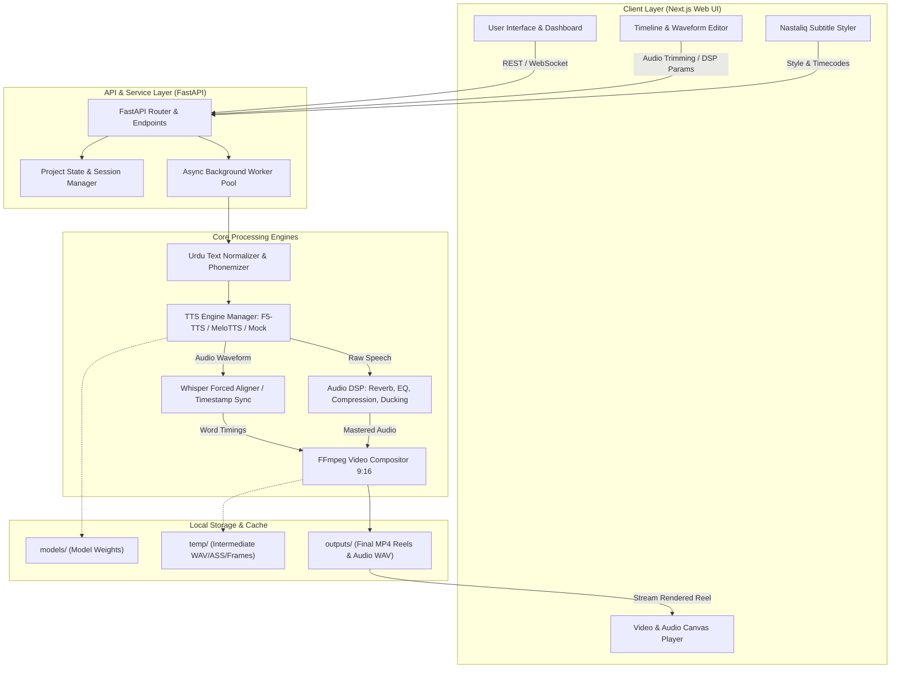
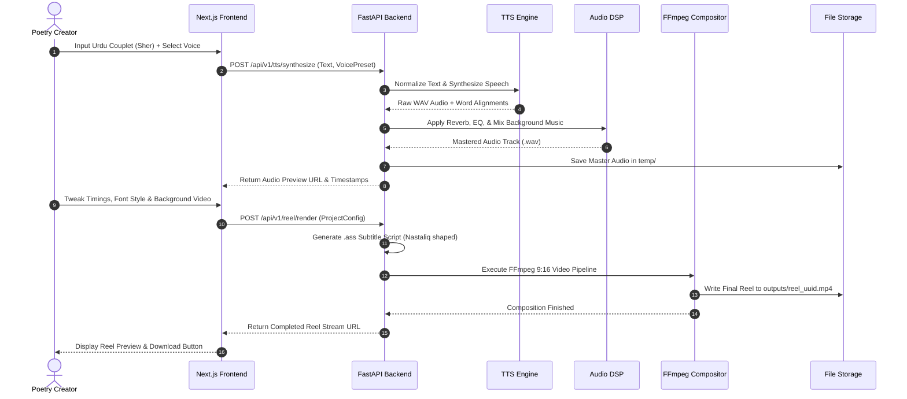

# AlfaazStudio - System Architecture & Technical Specifications

AlfaazStudio is a specialized, local-first multimedia creation suite designed to synthesize authentic Urdu poetry (Shayari) voice-overs, apply cinematic soundscapes, and render viral 9:16 Instagram Reels with animated Nastaliq Urdu typography.

---

## 1. High-Level System Architecture Diagram

The following architecture diagram outlines the core components and interaction pathways:



---

## 2. Core Component Architecture

The AlfaazStudio platform is decomposed into decoupled, modular components:

### 2.1 Frontend Component (Next.js)
- **Framework**: Next.js 14+ (App Router, React 18/19, TypeScript).
- **Styling**: Tailwind CSS with dark-mode aesthetic suited for studio environments.
- **Waveform Visualization**: Wavesurfer.js for multi-track audio scrubbing, verse splitting, and volume envelope control.
- **Urdu Typography Rendering**: Custom web font loaders for *Jameel Noori Nastaleeq*, *Noto Nastaliq Urdu*, and *Gulzar*, configured with CSS OpenType features and bidirectional (`dir="rtl"`) text containment.
- **Real-time Canvas Preview**: Real-time rendering of 9:16 canvas showing background loops, overlay opacity, and synchronized kinetic Urdu captions.

### 2.2 Backend Component (FastAPI)
- **Framework**: FastAPI (Python 3.11) with Uvicorn ASGI server.
- **Asynchronous Processing**: Non-blocking endpoints with background task runners for CPU/GPU intensive speech synthesis and FFmpeg rendering.
- **Pydantic Validation**: Strict schema enforcement for poetry stanzas, TTS configuration, DSP filter parameters, and render jobs.
- **Health & Telemetry**: Health checks, hardware detection (CUDA availability, VRAM quota, CPU core allocation), and progress streaming via WebSockets / Server-Sent Events (SSE).

### 2.3 TTS Engine Component
- **Modular Adapter Pattern**: A unified `BaseTTSEngine` interface allowing dynamic switching between:
  1. `F5TTSEngine`: Flow matching diffusion model with reference voice cloning.
  2. `MeloTTSEngine`: Lightweight VITS synthesis for fast CPU/commercial pipelines.
  3. `MockTTSEngine`: Deterministic signal generator generating synthesized speech tones for rapid testing and headless CI/CD.
- **Urdu Text Processing**: Diacritic handling (Aerab), ligature normalization, Arabic/Urdu numeral conversions, and verse break punctuation (`،` `۔` `؟`).

### 2.4 Audio DSP & Mixing Component
- **Mastering Chain**:
  - Parametric EQ (warm lows, airy highs suited for Urdu poetry recitations).
  - Convolution Reverb (hall/plate acoustic simulations).
  - Dynamic Range Compression (consistent vocal presence).
  - Background Music Ducking (sidechain compression dipping BGM when poetry vocals are active).
- **Libraries**: Librosa, SoundFile, SciPy, PyDub.

### 2.5 Subtitle & Typography Component
- **Format**: Advanced SubStation Alpha (`.ass`) with full support for vertical positioning, font shaping, shadow glows, and karaoke-style timing tags (`\k`).
- **Font Rendering**: Uses FFmpeg with `libass` compiled with HarfBuzz and FriBidi to guarantee flawless Nastaliq cursive ligature joining without disjointed letter errors.

### 2.6 Video Compositing Component (FFmpeg)
- **Format**: Instagram Reels / TikTok / YouTube Shorts compliant:
  - Resolution: 1080x1920 (9:16 aspect ratio).
  - Frame Rate: 30 fps or 60 fps.
  - Video Codec: H.264 (NVENC hardware accelerated when available, fallback to libx264).
  - Audio Codec: AAC, 48kHz, 320kbps stereo.
  - Filters: Vignette, subtle film grain, zoom-in ambient motion, and hardsubbed Urdu subtitles.

---

## 3. Data Flow Diagram



---

## 4. Directory & Module Structure

```text
alfaaz-studio/
├── backend/                  # FastAPI Application
│   ├── app/
│   │   ├── __init__.py
│   │   ├── main.py          # FastAPI application entrypoint
│   │   ├── config.py        # Pydantic BaseSettings
│   │   ├── api/             # API Route handlers (v1)
│   │   │   ├── health.py
│   │   │   ├── tts.py
│   │   │   ├── audio.py
│   │   │   └── reel.py
│   │   ├── core/            # Business logic & processors
│   │   │   ├── urdu.py      # Nastaliq text normalization
│   │   │   ├── tts_engine.py# Abstract & concrete TTS adapters
│   │   │   ├── dsp.py       # Audio filters, reverb, ducking
│   │   │   ├── subtitle.py  # ASS subtitle file generator
│   │   │   └── video.py     # FFmpeg render pipeline
│   │   └── schemas/         # Pydantic request/response models
│   ├── tests/               # Pytest suite (80%+ target coverage)
│   ├── requirements.txt
│   └── pyproject.toml
├── frontend/                 # Next.js Web Studio
│   ├── src/
│   │   ├── app/             # App Router pages & layouts
│   │   ├── components/      # UI components (Waveform, Timeline, Styler)
│   │   ├── lib/             # API client, audio helpers
│   │   └── styles/          # Global styles, fonts
│   ├── public/              # Static assets, Nastaliq fonts
│   ├── package.json
│   └── tsconfig.json
├── infra/                    # Docker, deployment, system scripts
│   └── docker/
│       ├── Dockerfile.backend
│       ├── Dockerfile.frontend
│       └── docker-compose.yml
├── models/                   # Local weights cache (F5-TTS, Melo, Whisper)
├── outputs/                  # Exported reels and mastered audio
├── temp/                     # Ephemeral intermediate processing files
├── scripts/                  # Automation & validation scripts
├── ARCHITECTURE.md           # This document
├── MODEL_LICENSES.md         # Compliance and legal terms
├── PRIVACY.md                # Privacy & security manifesto
└── PROJECT_PLAN.md           # Master roadmap and phase tracker
```

---

## 5. Security, Hardware Acceleration & Fault Tolerance

1. **GPU Acceleration & CPU Fallback**:
   - Primary: PyTorch with CUDA 12.1+ / cuDNN for fast flow matching and FFmpeg `h264_nvenc`.
   - Fallback: Auto-detection switches to CPU multithreading (`torch.set_num_threads`) and `libx264` if no CUDA device is present.
2. **Local Privacy**:
   - Zero outbound requests for speech generation or media compilation.
   - All user poetry, custom voices, and media files remain on the host machine.
3. **Graceful Degradation**:
   - If an exotic font glyph fails to render in Nastaliq, the font engine falls back gracefully down the font chain to ensure no text disappears or causes video render crashes.
